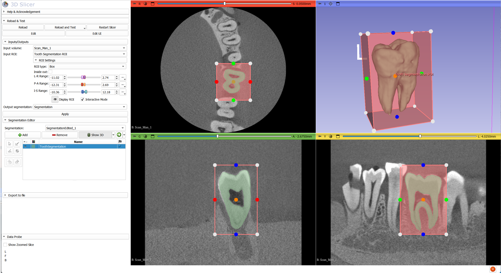

SlicerCBCTToothSegmentation
===========================

Slicer extension for automated segmentation of individual teeth in cone-beam CT dental scans using a deep-learning based approach.

This module requires the Pytorch extension which can be installed via the Extension Manager. Python dependencies such as MONAI will be automaically installed by the module if not available.The trained segmentation module is downloaded by the module. 

Usage
-----

1. Load the CBCT scan to be segmented into slicer and select it as the `Input volume`.
2. Create a new `Input ROI` and adjust the bounding box to surround the tooth of interest that you would like to segment. 
3. Specify an 'Output Segmentation' and click the 'Apply' button. 

- Repeat steps 2) and 3) to segment multiple teeth. 
- Edit the automated output segmentation using the `Paint` and `Erase` tools in the `Segmentation editor` built into the module
- Directly save the output segmentation to file in the `Export to file` section. 

License
-------

This extension is covered by the Apache License, Version 2.0:

https://www.apache.org/licenses/LICENSE-2.0

